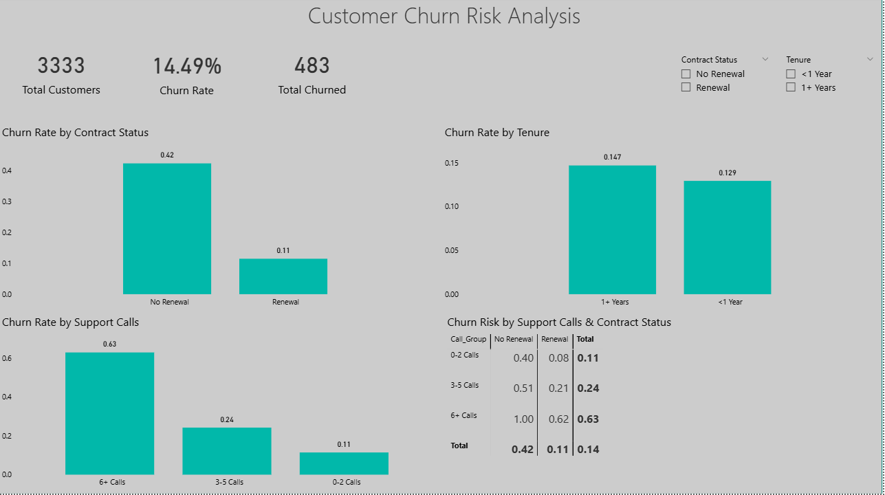

# Customer Churn Risk Analysis

This project analyzes telecom customer churn using Excel and Power BI to identify churn drivers, customer risk segments, and behavioral patterns that influence retention.

---

## Business Questions

• What percentage of customers churn?  
• Does contract renewal reduce churn?  
• Do support calls correlate with churn risk?  
• Which customer segments have the highest churn risk?

---

## Dashboard Preview

---

## Key Insights

• Customers without contract renewal churn nearly **4x more often**.  
• Churn risk increases sharply after **3+ support calls**.  
• Customers with **6+ support calls show churn rates above 60%**.

---

## Tools Used

Excel – data preparation  
Power BI – dashboard creation  
DAX – churn metrics and segmentation  

---

## Dataset

The dataset contains **3,333 telecom customers** with behavioral metrics including:

• contract renewal  
• support calls  
• monthly charges  
• data usage  
• customer tenure
